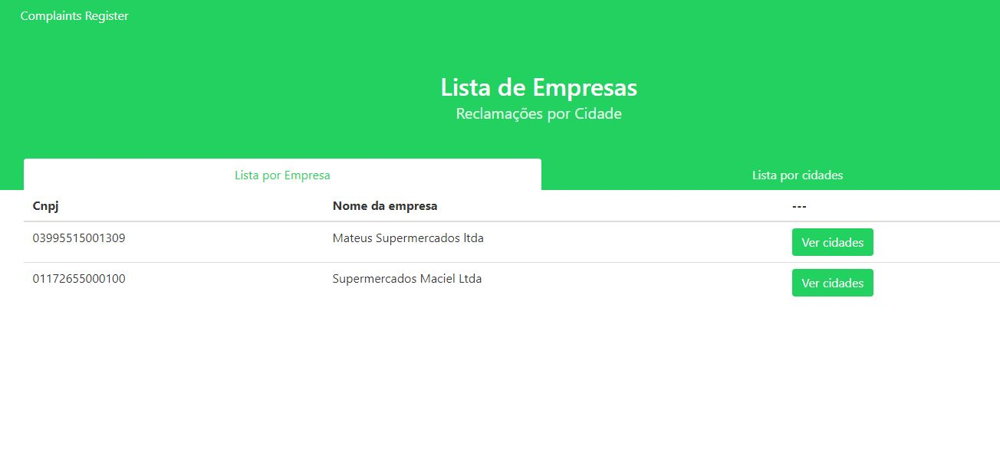
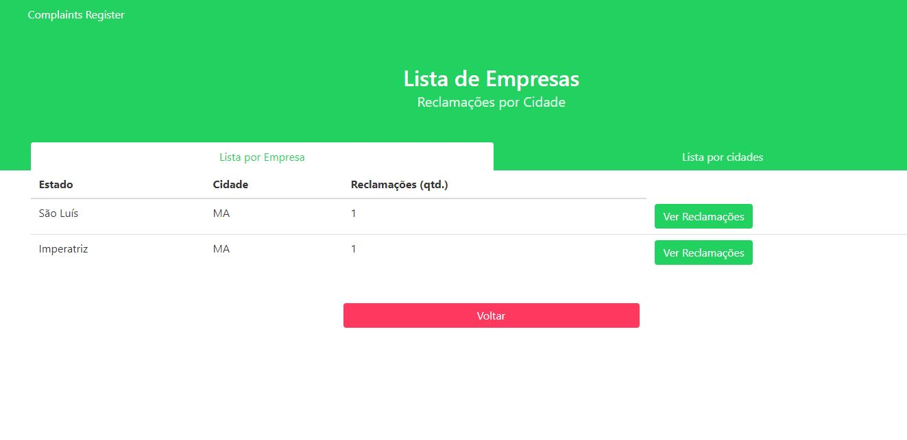
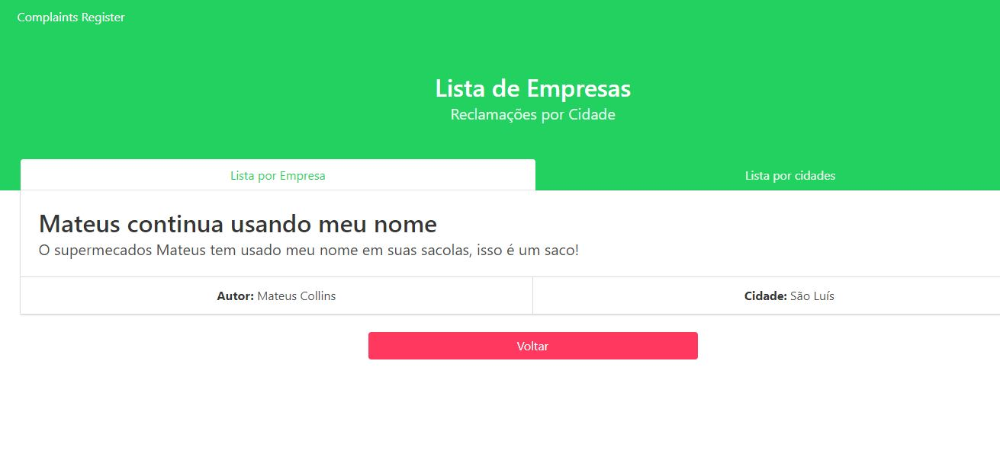
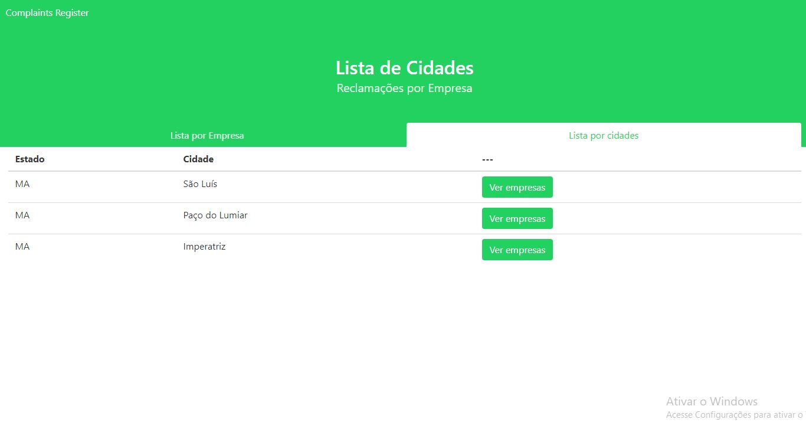
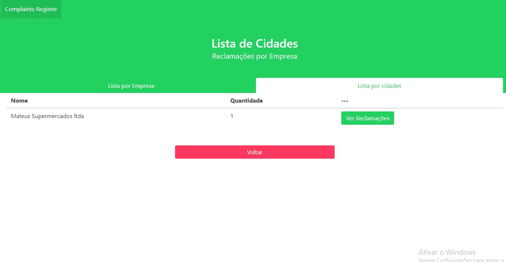
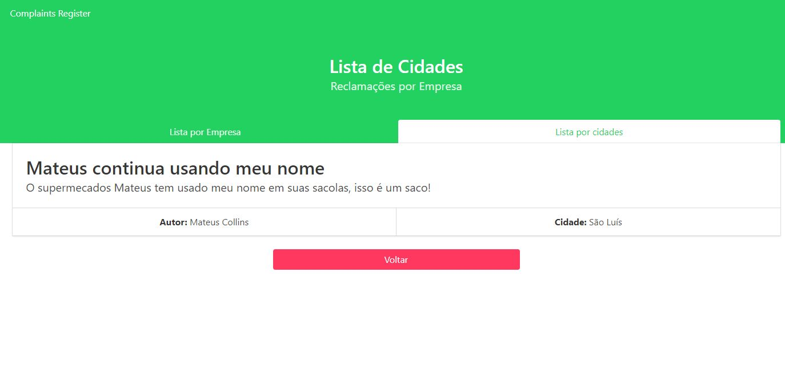

# Como funciona o Front

### Busca por empresa
Essa é a tela inicial. Possui duas abas para que a pessoa localize as reclamações buscando tanto a partir das empresas quanto a partir das cidades. Abaixo, uma lista das empresas que possuem reclamações cadastradas dentro do sistema.

Ao lado esquerdo, temos botôes que dão a opção de mostrar todas as cidades que possuem ocorrências de reclamação da empresa escolhida. Ao clickar nesse botão. somos levados a outra tela

Essa tela, como dita acima, lista cidades onde a empresa selecionada possue reclamações. Vemos que a tela agora possui um botão de "volta", que retorna para a tela anterior. Os botões a direita agora são capazes de mostrar as reclamações cadastradas no sistema, usando como base a cidade e a empresa escolhida anteriormente.

Ao final, consegue-se sem mais problemas ver as reclamações cadastradas que respeitam os parâmentros falado antencipadamente
### Busca por cidade
Ao clicar na outra aba, podemos usar a busca por cidade. Abaixo, uma lista das cidades que possuem reclamações cadastradas dentro do sistema.

Ao lado esquerdo, temos botões que dão a opção de mostrar todas as empresas que possuem reclamações na cidade selecionada.

Essa tela, como dita acima, lista empresas que possuem reclamações na cidade. Vemos que a tela também possui um botão de "volta", que retorna para a tela anterior. Os botões a direita agora são capazes de mostrar as reclamações cadastradas dessas empresas.

Ao final, consegue-se sem mais problemas ver as reclamações cadastradas que respeitam os parâmentros falado antencipadamente